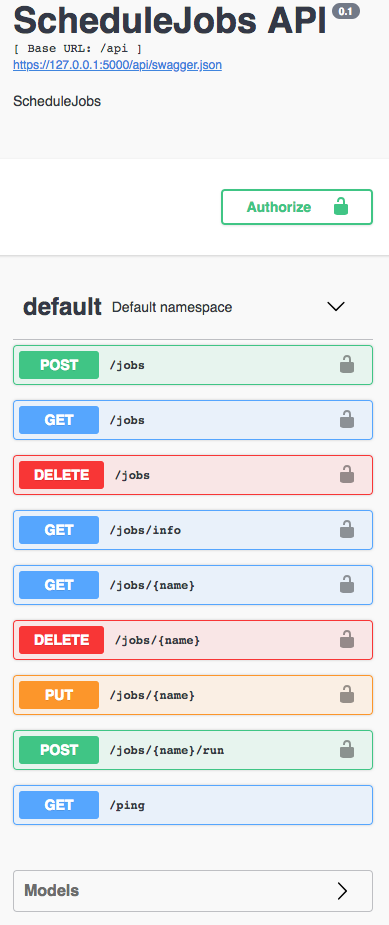

[](https://circleci.com/gh/CaptorAB/JobsScheduler)

# ScheduleJob

python-crontab, flask-restplus and docker based replacement for Azure Scheduler

Continuous integration is running on CircleCI.

Through flask-restplus it shows swagger documentation of the api



It validates the payload with jsonschema

The endpoint TBD returns data with the same format(almost) as :
https://docs.microsoft.com/en-us/rest/api/scheduler/jobs/list

## Configuration

create a file app/settings.py, with

```
JWKS_URI = "https://someplace.com/.well-known/jwks.json"
JWT_AUDIENCE = "YOUR_AUDIENCE"
JWT_REQUIRED_SCOPES = ["RequiredScope1", "RequiredScope2"]
```

create a file .env with

```
docker_tag=docker.io/your_id_/your_repo
```

## Build

```
make docker_build
```

## Unit tests

```
make test
```

## Run locally

```
mongod
make start
```

# Current cron jobs

## Edit in docker image

```
env EDITOR=ng-cjk crontab -e
```

## Edit under macosx

```
env EDITOR=emacs crontab -e
```

## View under macosx and linux

```
crontab -l
```

# Document reference

https://stackabuse.com/scheduling-jobs-with-python-crontab/
